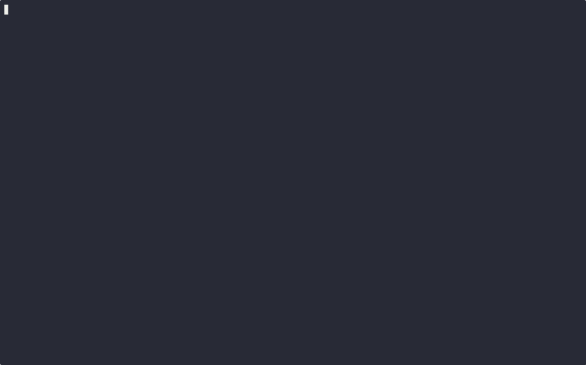

# slashmetrics

slashmetrics is a terminal-first Prometheus metric explorer that scrapes an endpoint, plots live data, and lets you pick the series you are interested in. Think Grafana Explore, but in your terminal.

slashmetrics is proudly supported by **[Promhub](https://promhub.shipit.dev?utm_source=slashmetrics)**

[](https://promhub.shipit.dev?utm_source=slashmetrics)

## Demo



## Installation

- Navigate to the [latest release](https://github.com/brennerm/slashmetrics-cli/releases/latest)
- Download the appropriate binary for your OS/architecture
- Unpack the binary and move it to a directory in your PATH (e.g. `/usr/local/bin`)
- Make the binary executable: `chmod +x /usr/local/bin/slashmetrics`

## Features
- Live-updating terminal UI for Prometheus metrics
- Select specific metric to monitor
- Show/hide individual time series (label combinations)
- Configurable scrape intervals
- Lightweight and easy to use

## Usage

```bash
$ slashmetrics --help
```
